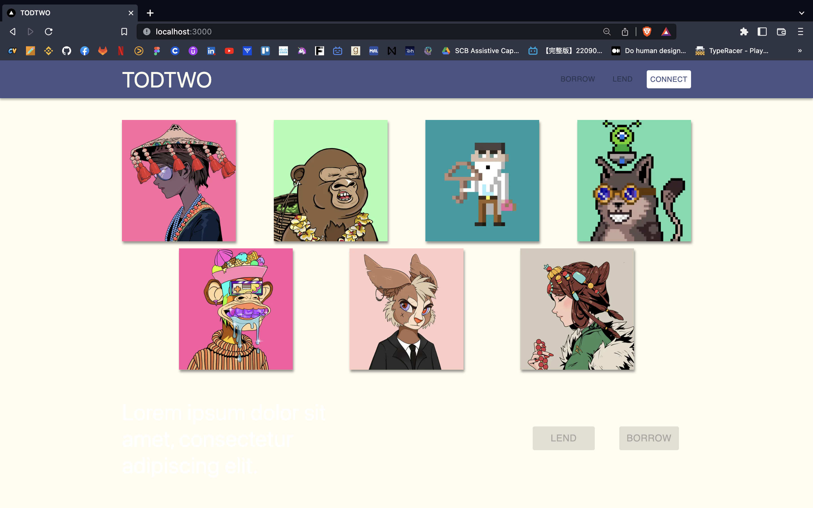
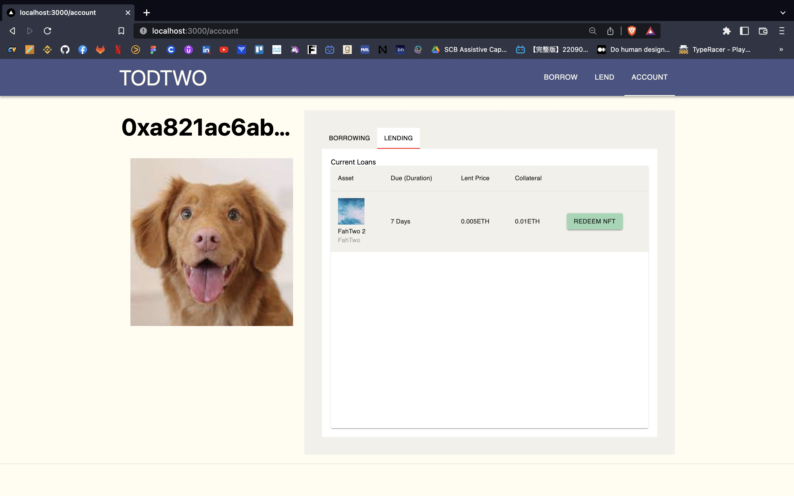
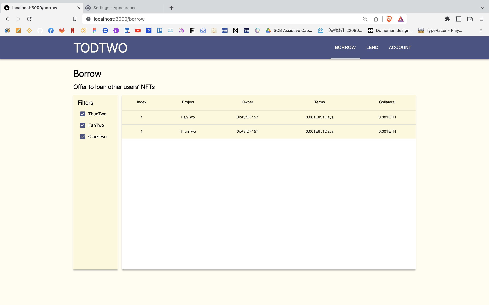
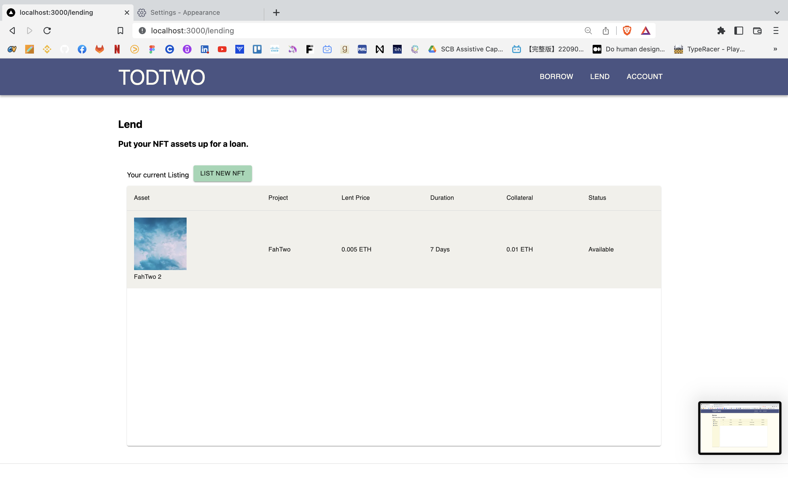
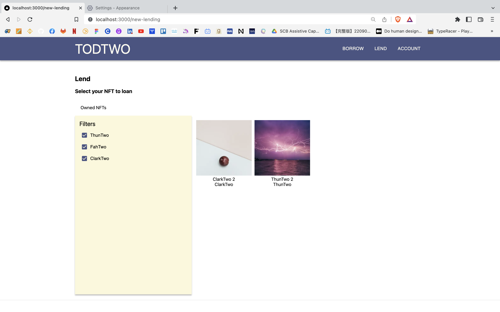

# TodTwo Frontend

## Table of contents

- [General info](#general-info)
- [Technologies](#technologies)
- [Setup](#setup)

#

## General info

This is the frontend repo for TodTwo NFT Lending platform project.
Users can interact with TodTwo smart contracts using our frontend.

## Technologies

Project is created with:

- Next.js
- Material-UI

## Set up

To start the frontend locally, here are the steps:

0. Install MetaMask :fox_face: and at least 1 Goerli account (with some GoerliETH)

1. Install dependencies

```bash
npm install
# or
yarn
```

2. Run the development server

```bash
npm run dev
# or
yarn dev
```

3. Open [http://localhost:3000](http://localhost:3000) with your browser to see the result.

## Pages

1. Landing Page



2. Account Page : User can check and manage their current loans



3. Borrow Page : User, as a borrower, can view all available NFTs



4. Lend Page : User, as a lender, can see their current listing status



5. New Lending Page : User, as a lender, can list new NFT to the platform


